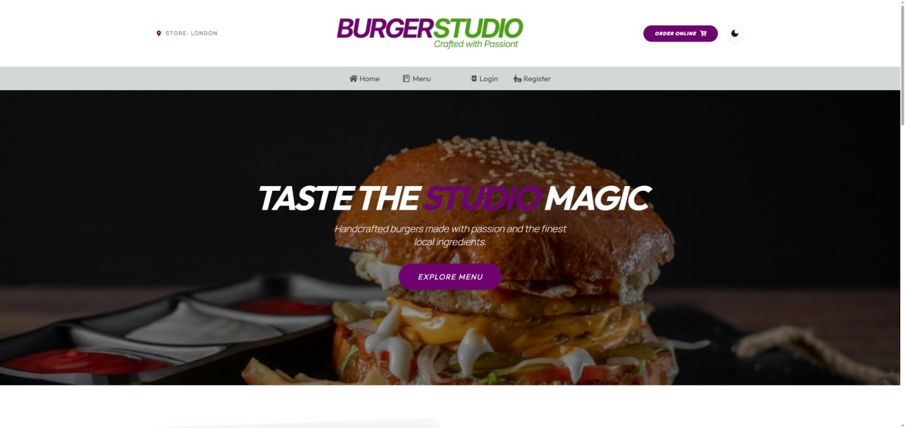
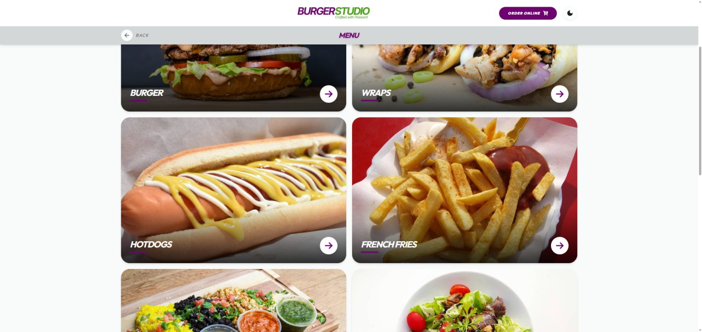
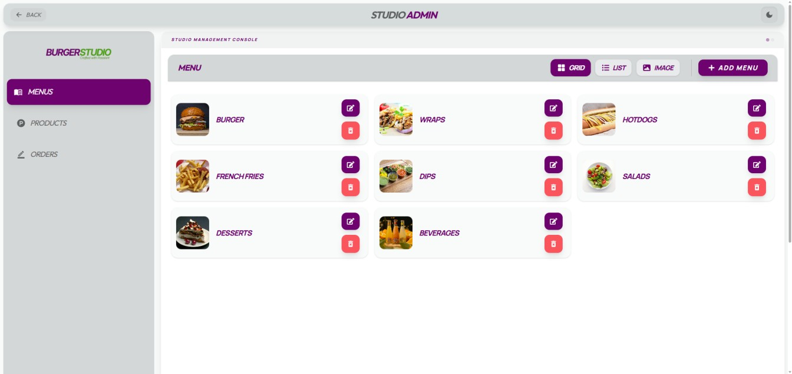
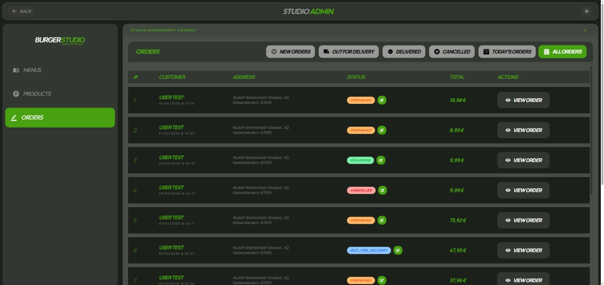
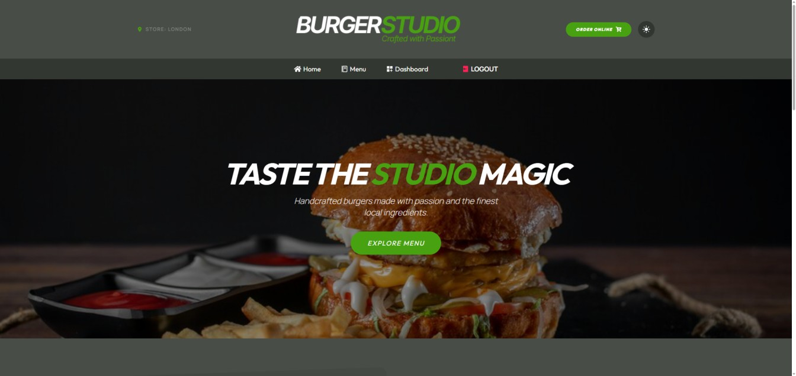
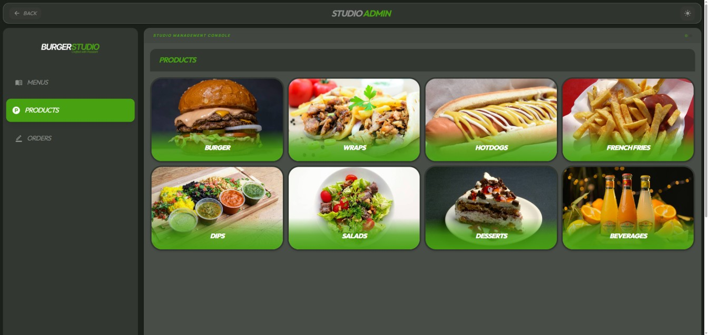
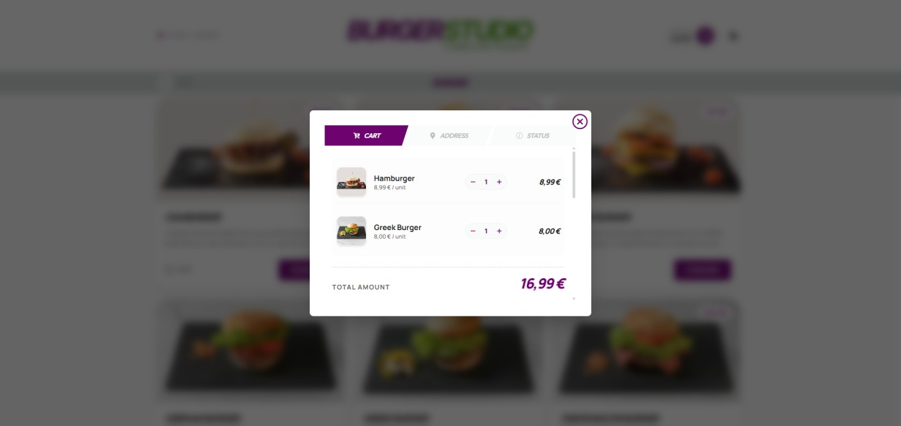
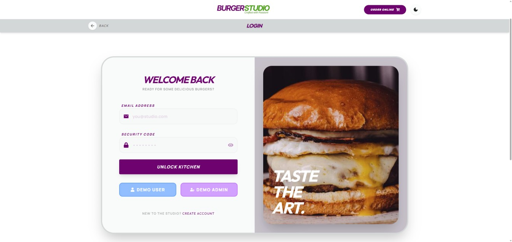

# 🍔 Burger Studio

<div align="center">
  
  <br />
  <p>
    <strong>Full-Stack Food Ordering Platform</strong>
  </p>
  <a href="https://burgerstudio.onrender.com">🚀 Live Demo</a> •
  <a href="https://github.com/Tanju67/backend-burgerStudio">📂 Backend Repo</a>
</div>

---

## 📱 Screenshots

<table width="100%">
  <tr>
    <td width="50%" align="center">
      
      <br /><em>Modern Home Page</em>
    </td>
    <td width="50%" align="center">
      
      <br /><em>Menu & Categories</em>
    </td>
  </tr>
  <tr>
    <td width="50%" align="center">
      
      <br /><em>Admin Dashboard</em>
    </td>
    <td width="50%" align="center">
      
      <br /><em>Order Tracking</em>
    </td>
  </tr>
   <tr>
    <td width="50%" align="center">
      
      <br /><em>Dark Mode</em>
    </td>
    <td width="50%" align="center">
      
      <br /><em>Product Management</em>
    </td>
  </tr>
  <tr>
    <td width="50%" align="center">
      
      <br /><em>Cart Functionality</em>
    </td>
    <td width="50%" align="center">
      
      <br /><em>Demo admin & user login</em>
    </td>
  </tr>
</table>

---

## 📝 Overview

**Burger Studio** is a modern food ordering platform built with React and TypeScript. It offers an end-to-end experience where users can browse menus, manage their carts, and track orders in real-time. The project also features a comprehensive **Admin Dashboard** for menu management and order processing.

> [!TIP]
> This project is a complete **refactor** and rebuild of an earlier version from my learning journey. It has been redesigned with a cleaner architecture and modern state management patterns.

---

## ✨ Key Features

- 🛒 **Shopping Workflow:** Seamless food ordering interface with a responsive shopping cart.
- 👨‍💼 **Admin Dashboard:** Dedicated panel for managing categories, products, and customer orders.
- 📦 **Order Tracking:** Real-time status updates and order history for users.
- ☁️ **Cloudinary Integration:** Cloud-based image upload system for product management.
- ⚡ **Optimistic Updates:** Instant UI feedback for CRUD operations using RTK Query.
- 🛡️ **Form Validation:** Robust client-side validation using Zod and React Hook Form.
- 👤 **Demo Access:** Pre-configured Demo User and Demo Admin accounts for instant testing.

---

## 🛠 Tech Stack

### Frontend & UI


### State & Logic


---

## 🧠 Architecture & Challenges

### Optimistic Updates & State Management

One of the primary challenges was managing server state efficiently across different parts of the application. To improve responsiveness and user experience, I implemented **optimistic updates** using **Redux Toolkit Query**. This allows the UI to update immediately during create or delete operations before the server response is even received.

### Global Error Handling

I implemented a centralized error-handling strategy to ensure a consistent user experience. Depending on the scenario, the application provides feedback through custom error pages or real-time **Toast notifications**, ensuring the user is never left wondering what went wrong.

### Evolution of the Project

Compared to the initial version of this project, this iteration introduces a much more scalable architecture. By integrating **React Hook Form + Zod**, I achieved type-safe form management and more structured UI patterns that are easier to maintain and extend.

---

## 💡 What I Learned

This project significantly enhanced my understanding of modern frontend architecture, API integration, and scalable state management. Rebuilding the project from scratch allowed me to identify weaknesses in my earlier implementations and replace them with cleaner logic, better UX decisions, and production-ready code patterns.

---

## ⚙️ Getting Started

### 1. Clone repositories

```bash
git clone https://github.com/Tanju67/backend-burgerStudio.git
git clone https://github.com/Tanju67/frontend-burgerStudio.git
```

### 2. Install dependencies

```bash
cd backend-burgerStudio
npm install

cd ../frontend-burgerStudio
npm install
```

### 3. Create .env file in backend and write your variable

```bash
MONGO_URI=(your value)
JWT_SECRET=(your value)
JWT_LIFETIME=(your value)
CLOUD_NAME=(your value)
API_KEY=(your value)
API_SECRET=(your value)
PORT=5000

```

### 4. Run the project

```bash
# backend
cd backend-burgerStudio
npm run dev

# frontend
cd frontend-burgerStudio
npm run dev
```

---

## 📄 License

MIT
